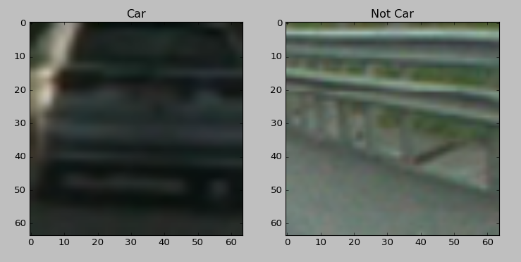
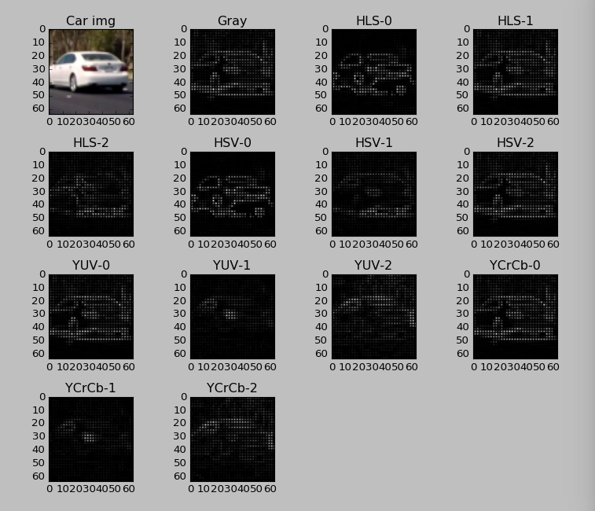
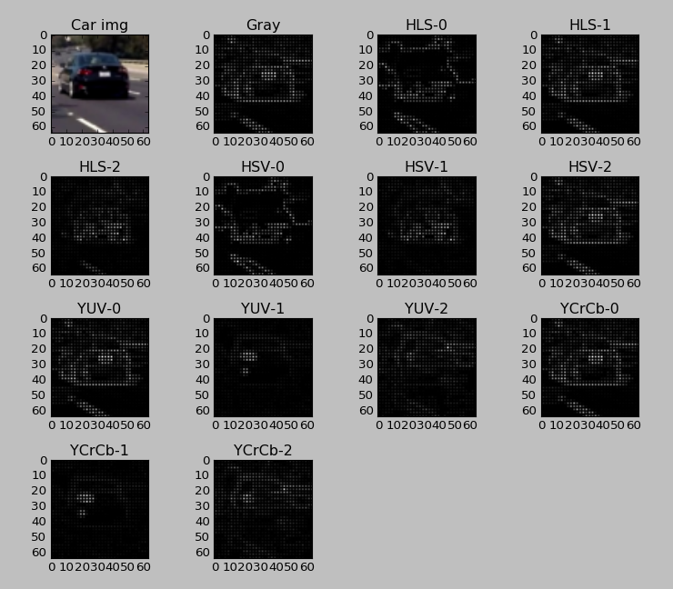
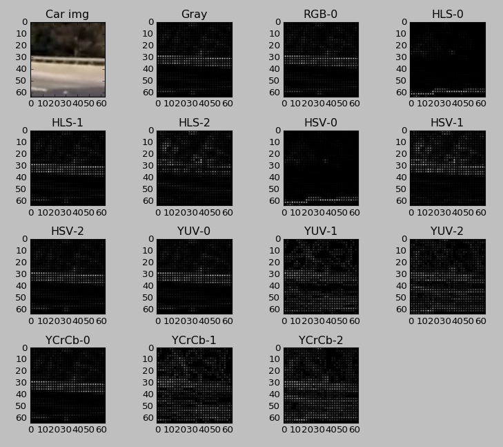

# Carnd-P5: Vehicle Detection and Tracking (In Progress)

---

**Vehicle Detection Project**

The goals / steps of this project are the following:

* Perform a Histogram of Oriented Gradients (HOG) feature extraction on a labeled training set of images and train a classifier Linear SVM classifier
* Optionally, you can also apply a color transform and append binned color features, as well as histograms of color, to your HOG feature vector. 
* Note: for those first two steps don't forget to normalize your features and randomize a selection for training and testing.
* Implement a sliding-window technique and use your trained classifier to search for vehicles in images.
* Run your pipeline on a video stream and create a heat map of recurring detections frame by frame to reject outliers and follow detected vehicles.
* Estimate a bounding box for vehicles detected.

[//]: # (Image References)
[image1]: ./examples/car_not_car.png
[image2]: ./examples/HOG_example.jpg
[image3]: ./examples/sliding_windows.jpg
[image4]: ./examples/sliding_window.jpg
[image5]: ./examples/img50.jpg
[image6]: ./examples/example_output.jpg
[video1]: ./project_video.mp4

---
### File not included and needed download
From Udacity: 
 * [vehicles_smallset.zip](https://s3.amazonaws.com/udacity-sdc/Vehicle_Tracking/vehicles_smallset.zip)
 * [non-vehicles_smallset.zip](https://s3.amazonaws.com/udacity-sdc/Vehicle_Tracking/non-vehicles_smallset.zip)
 * [vehicles.zip](https://s3.amazonaws.com/udacity-sdc/Vehicle_Tracking/vehicles.zip)
 * [non_vehicles.zip](https://s3.amazonaws.com/udacity-sdc/Vehicle_Tracking/non-vehicles.zip)

From Origianl  KITTI vision benchmark suite:
 * [GTI vehicle image database](http://www.gti.ssr.upm.es/data/Vehicle_database.html)
 
Udacity's own data:
 * [annotations](https://github.com/udacity/self-driving-car/tree/master/annotations)

---

## [Rubric](https://review.udacity.com/#!/rubrics/513/view) Points
###Here I will consider the rubric points individually and describe how I addressed each point in my implementation.  

---
###Writeup / README

####1. Provide a Writeup / README  
You're reading it!

###Histogram of Oriented Gradients (HOG)

####1. Explain how (and identify where in your code) you extracted HOG features from the training images.

The code for this step is contained in get_hog_features() cell of [classifier.py](classifier.py)  

I started by reading in all the `vehicle` and `non-vehicle` images.  Here is an example of one of each of the `vehicle` and `non-vehicle` classes:



Using [exercise/get_hog.py](exercise/get_hog.py), I then explored different color spaces and different `skimage.hog()` parameters (`orientations`, `pixels_per_cell`, and `cells_per_block`).  I grabbed random images from each of the two classes and displayed them to get a feel for what the `skimage.hog()` output looks like.

Here two car examples using different color spaces and HOG parameters of `orientations=9`, `pixels_per_cell=(2, 2)` and `cells_per_block=(8, 8)`: 








Choosing `pixels_per_cell=(2, 2)` and `cells_per_block=(8, 8)` for viewing can see the car shape ealier to decide which one to pick. However, I have to use `pixels_per_cell=(8, 8)` and `cells_per_block=(2, 2)` for training due to the memory constrain.

####2. Explain how you settled on your final choice of HOG parameters.

I tried various combinations of parameters and `pixels_per_cell=(8, 8)`, `cells_per_block=(2, 2)`, and `orientations=8` are good HOG parameters. For the color space, YUV channel 0 seems be good for the cars.

####3. Describe how (and identify where in your code) you trained a classifier using your selected HOG features (and color features if you used them).

Impletmented at train() in [classifier.py](classifier.py), I trained a linear SVM using combination of features hogs of YCrCb channel 1, 2, and 3, plus binned color features and color histogram features. Training data set are from [vehicles.zip](https://s3.amazonaws.com/udacity-sdc/Vehicle_Tracking/vehicles.zip) and [non_vehicles.zip](https://s3.amazonaws.com/udacity-sdc/Vehicle_Tracking/non-vehicles.zip). All data had scaled using [StandardScaler](http://scikit-learn.org/stable/modules/generated/sklearn.preprocessing.StandardScaler.html). Split the data into 80:20 of train and test set. The training accuracy is 100%, and test accuracy 0.9986. I saved the scaler and training model to files `x_scaler.pkl` and `linearSVC_model.pkl` for later pipeline to use.

```
/usr/bin/python3.5 classifier.py
Extrating features 8792  car images  15908  non car images
83.39084649085999 seconds to load imags extract features
X shape =  (24700, 4800)
X_scaler saved to: x_scaler.pkl
Training LinearSVC
11.038205862045288 seconds to train SVC...
Train Accuracy of SVC =  1.0
Test Accuracy of SVC =  0.993319838057
classified model saved to: linearSVC_model.pkl
Train Accuracy of SVC after reload =  1.0
Test Accuracy of SVC after reload =  0.993319838057
8.606910705566406e-05 Seconds to predict with SVC
Process finished with exit code 0
```

###Sliding Window Search

####1. Describe how (and identify where in your code) you implemented a sliding window search.  How did you decide what scales to search and how much to overlap windows?

I decided to search random window positions at random scales all over the image and came up with this (ok just kidding I didn't actually ;):

![alt text][image3]

####1. Show some examples of test images to demonstrate how your pipeline is working.  What did you do to try to minimize false positives and reliably detect cars?

Ultimately I searched on two scales using YCrCb 3-channel HOG features plus spatially binned color and histograms of color in the feature vector, which provided a nice result.  Here are some example images:

![alt text][image4]
---

### Video Implementation

####1. Provide a link to your final video output.  Your pipeline should perform reasonably well on the entire project video (somewhat wobbly or unstable bounding boxes are ok as long as you are identifying the vehicles most of the time with minimal false positives.)
Here's a [link to my video result](./project_video.mp4)


####2. Describe how (and identify where in your code) you implemented some kind of filter for false positives and some method for combining overlapping bounding boxes.

I recorded the positions of positive detections in each frame of the video.  From the positive detections I created a heatmap and then thresholded that map to identify vehicle positions.  I then used blob detection in Sci-kit Image (Determinant of a Hessian [`skimage.feature.blob_doh()`](http://scikit-image.org/docs/dev/auto_examples/plot_blob.html) worked best for me) to identify individual blobs in the heatmap and then determined the extent of each blob using [`skimage.morphology.watershed()`](http://scikit-image.org/docs/dev/auto_examples/plot_watershed.html). I then assumed each blob corresponded to a vehicle.  I constructed bounding boxes to cover the area of each blob detected.  

Here's an example result showing the heatmap and bounding boxes overlaid on a frame of video:

![alt text][image5]

---

###Discussion

####1. Briefly discuss any problems / issues you faced in your implementation of this project.  Where will your pipeline likely fail?  What could you do to make it more robust?

Here I'll talk about the approach I took, what techniques I used, what worked and why, where the pipeline might fail and how I might improve it if I were going to pursue this project further.  

* It's really hard to remove false postives, not without scarifing the true positives. Ideal way is to seperate the condifence between true positives and false postive as much as possible. Experiented with hard-negative mining a lot, but seems no effect, unless put around 50 times of negative images more than other images. This quickly exhasted the memeoyry for processing adn training the model. Played with C = 1, 0.9 , 0.01, 0.001, and 0.0001 in [LinearSVC]
(http://scikit-learn.org/stable/modules/generated/sklearn.svm.LinearSVC.html), and found C=0.0001 has good effect on negative images.
* Data set for training is really important, then select the features to extract, and then select the model with pararmeter search with the testing. Visusalization will help in building and testing the model. Haven't try it yet, but [GridSearchCV](http://scikit-learn.org/stable/modules/generated/sklearn.model_selection.GridSearchCV.html) will save time on looking good combinations of the models and parameter grids.
* It takes a long time to process one frame, more than the real time. More improvemnts and techniques are needed for real SDC applications.
* Most of the false positives tend to have a structure shape, like traffic signs, bridges, curbs, that has complicated lines, just like a car. This should due to the feature extraction that is mostly HOG for the abstraction of a car structure. Unfortunatly it may missing the information of the structure relationship that causes a lot of false positives. This's what CNN is good at, it keeps the relationship of surrounding structure/pixels.
* It's surprising the model is gernerlized to detect the car most of the time, without "hard-true" postive mining.

---

### References
* Class dissusion forums
* [Histogram of Oriented Gradients](http://scikit-image.org/docs/dev/auto_examples/plot_hog.html)
* [On-Road Vehicle and Lane Detection](https://web.stanford.edu/class/ee368/Project_Spring_1415/Reports/Lee_Wong_Xiao.pdf)
* [Histogram of Oriented Gradients and Object Detection](http://www.pyimagesearch.com/2014/11/10/histogram-oriented-gradients-object-detection/)
* [Scaling the regularization parameter for SVCs](http://scikit-learn.org/stable/auto_examples/svm/plot_svm_scale_c.html#sphx-glr-auto-examples-svm-plot-svm-scale-c-py)
* [SPECIAL TOPICS 1 - THE KALMAN FILTER](https://www.youtube.com/watch?v=CaCcOwJPytQ&list=PLX2gX-ftPVXU3oUFNATxGXY90AULiqnWT)
